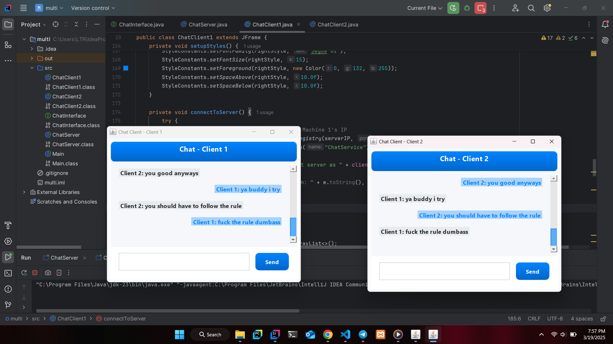

# Java-Project
<h1>Campus Feedback System 🏫💬</h1>

<h1>Overview</h1>
<br>

Welcome to the Campus Feedback System, a web application built with Java and a variety of powerful frameworks. This system allows students to provide feedback on various campus services, courses, and facilities. It aims to streamline the process of gathering and analyzing student feedback to help improve campus services.<br>

<h2>Features 🚀</h2><br>
✅ Real-time Feedback Submission – Allow students to provide feedback on different aspects of the campus.<br>
✅ Feedback Analysis – Automatically process and analyze feedback to identify trends.<br>
✅ User-friendly Interface – Easy-to-use interface for both students and campus administrators.<br>
✅ Data Storage – Stores feedback data securely in a relational database.<br>
✅ Multi-platform Support – Accessible across different devices (web, mobile, tablet).<br>

<h2>Tech Stack 🛠️</h2>
<h3>Java – The core language used for the backend logic of the system.</h3>

<h3>Spring Boot – A Java-based framework used to create stand-alone, production-grade Spring-based applications.</h3>

<h3>Spring MVC – For building the web layer and handling HTTP requests and responses.</h3>

<h3>Hibernate – For ORM (Object-Relational Mapping) to handle database transactions.</h3>

<h3>MySQL – Relational database to store the feedback data.</h3>

<h3>HTML/CSS/JS – For frontend development, creating a responsive and dynamic user interface.</h3>

<h2>Preview 🖥️</h2>
"What does my system look like?"
The system provides an easy interface for users to submit feedback and view the analyzed results.<br>
<br>

<h2>Setup & Installation 🏗️</h2>
1️⃣ Clone this repository:
```bash
git clone https://github.com/letera1/campus-feedback-system
cd campus-feedback-system
2️⃣ Install dependencies:

bash
Copy
Edit
mvn install
3️⃣ Run the backend server:

bash
Copy
Edit
mvn spring-boot:run
4️⃣ Open your browser and visit:

bash
Copy
Edit
http://localhost:8080
<h2>Future Improvements 🔮</h2> ✅ Integration with external APIs for campus service ratings.<br> ✅ Add a mobile app version for submitting feedback.<br> ✅ Enhance reporting features to generate PDF/Excel reports.<br> <h2>Contributor 🤝</h2> <h4>Letera Tujo</h4> 


<h1>Chatting Application using Java RMI 💬🖥️</h1>

<h1>Overview</h1>


Welcome to the Chatting Application built using **Java Remote Method Invocation (RMI)**. This application allows users to chat in real-time across multiple devices, with features such as private messaging, message history, and real-time updates. The app uses RMI to handle communication between clients and the server.<br>

<h2>Features 🚀</h2><br>
✅ **Real-time Messaging** – Send and receive messages instantly.<br>
✅ **Private Messaging** – Send private messages to other users.<br>
✅ **Message History** – View previous messages.<br>
✅ **User Authentication** – Log in to your account and chat with others.<br>
✅ **Multiple Clients** – Supports multiple users simultaneously.<br>

<h2>Tech Stack 🛠️</h2>
<h3>Java RMI – For remote method invocation between clients and server, enabling distributed communication.</h3>

<h3>Java – The core language used to develop the application logic.</h3>

<h3>Java Swing – For building a user-friendly graphical user interface (GUI) for the client-side application.</h3>

<h3>MySQL – For storing user information and message history.</h3>

<h3>RMI Registry – For binding and locating remote objects for communication.</h3>

<h2>Preview 🖥️</h2>
"What does my chat application look like?"
The application features a chat window, user list, and real-time message updates.<br>
<br>

<h2>Setup & Installation 🏗️</h2>
1️⃣ Clone this repository:
```bash
git clone https://github.com/letera1/chatting-application-rmi.git
cd chatting-application-rmi
2️⃣ Compile the Java classes:

bash
Copy
Edit
javac *.java
3️⃣ Start the RMI Registry:

bash
Copy
Edit
start rmiregistry
4️⃣ Run the server:

bash
Copy
Edit
java Server
5️⃣ Run the client:

bash
Copy
Edit
java Client
6️⃣ Open the client application, log in, and start chatting!

<h2>Future Improvements 🔮</h2> ✅ Add support for file transfers (images, documents).<br> ✅ Implement encryption for secure messaging.<br> ✅ Add group chats and video calls.<br> <h2>Contributors 🤝</h2> Letera Tujo 


